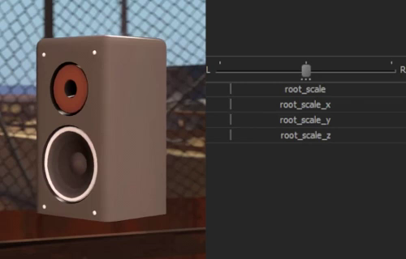
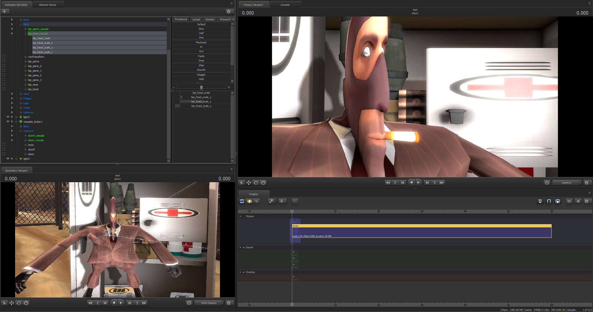

# [Beta] Directional Scale Controls (Stretching)

This script adds xyz scale controls for selected dag.

Credits: 
- **Me**
- @0TheSpy

Steam Workshop: not yet \
Donate: https://boosty.to/umfc

**Important - you should run this script from embedded python interpreter! \
Not compatible with Source 2 Filmmaker.**

## Installation
Copy folders to */game/usermod/scripts/sfm/*. \
If you're familiar with Python, you may invoke __Directional Scale Patch__'s main() from __sfm_init.py__ so it will be automatically executed on startup.

## Usage
To create controls, execute __Directional Scale Controls__ from "DAG Utilities Menu" in dag (bone) submenu. \
To display the scale changes, you should execute __Directional Scale Patch__ script from Scripts menu every time you restart SFM.

## Known issues
- Applying this script on multiple ancestor dags may cause FPS drops when posing their childs. E.g. applying it to __spine3__, __spine4__ and __neck__ will cause some lags when posing the __head__. This happens because SFM has retarded expression handling in slider controls. However, it doesn't affect completed animation and happens only when you directly change pos/rot from the interface. Dags without such ancestors or from any other "Animation Set" in the session won't cause the FPS drops. \
\
But if you really want to rescale every bone in the model and you have poor CPU - there's a solution. This script has an unused function __create_attr_slider_simple__ which creates slider without the use of an expression. Just swap function names with original __create_attr_slider__. This slider type, however, is limited to [0, 1] range and not remapable. To bypass this limit use __Facial Flex Unlocker__ (which unlocks not only flexes but all sliders in general) or Graph Editor mode — not UI-friendly, but lag-free.

- In order to minimize the effect from previous issue, I simplified the expression and by that sacrificed "Remap Slider Range" functionality. Actually, with the use of master-scale you can stretch the dag up to 64 times in every direction, but if you want more, or, for some reason, negative values — use __Facial Flex Unlocker__ or simply Graph Editor mode.

- Presented X Y Z is actually local bone orientation, they are not global and most commonly doesn't fit with RGB arrows. That's not a bug.